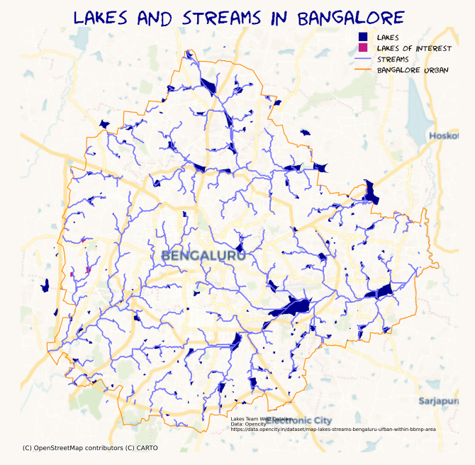
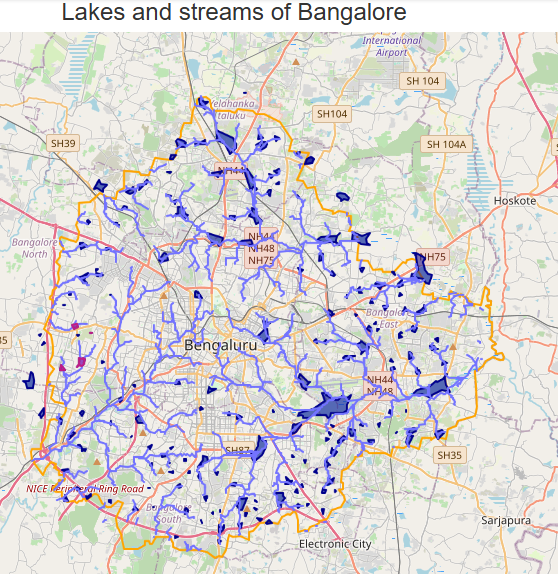

# Exploration of lakes in Bangalore West

Some codes in follow up for the lakes datajam in Bangalore.

**Work in progress.**

This work is in collaboration with the other team members of Bangalore West (add names).

[00_west_lakes_explore.ipynb](00_west_lakes_explore.ipynb) - IN PROGRESS - To add Google Colab link

A high level exploration of the lakes and streams in Bangalore. For the datajam, the lakes of interest where the following lakes:

- Herohalli Lake

- Mallathahalli Lake

- Srigandhakavalu Karabu Katte

- Ullalu lake-2

An interactive map with the lakes and streams can be found [HERE](https://ellenb.github.io/lakes-bang/lakes_streams.html)

Screenshot (static):

[01_lake_example_bang_west.ipynb](01_lake_example_bang_west.ipynb) 

This code shows how you can **download Sentinel 2 data** (10 meter resolution) for free  and create a **True Color image**, how you can compute a water index **(Modified Normalized Difference Water Index (MNDWI))** and how you can create an **animation** out of this.

This code uses the **Pystac library** in Python. The advantage is that we can extract only the data we need. Moreover, we can avoid downloading the data (even the small part) on a hard disk as the computations happen in memory. 

The animation can be found [here](herohalli_mndwi_2023.gif)

## [Other maps](maps_other)

These are some maps just created for fun.

## [Backup codes](backup)

- [Code to convert KML to Geojson](backup/convert_files.ipynb)
